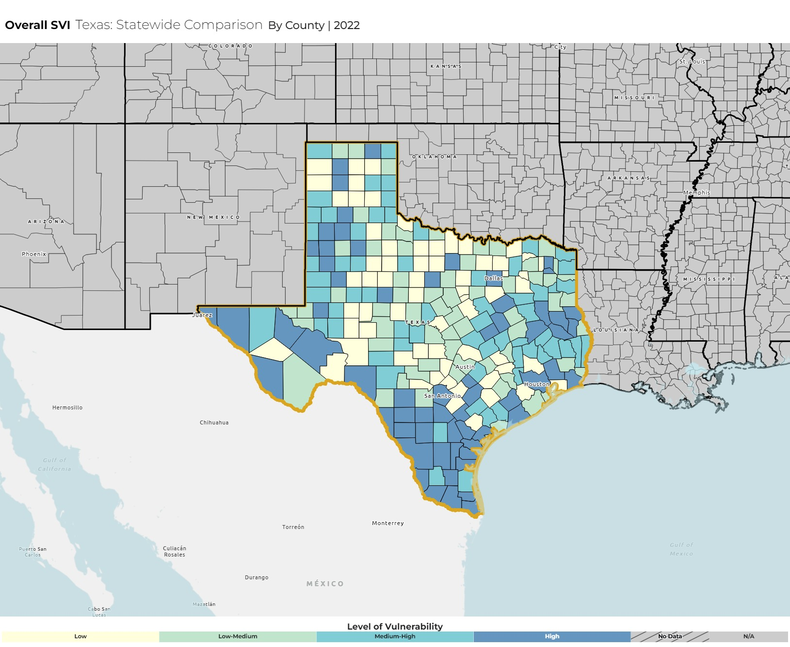
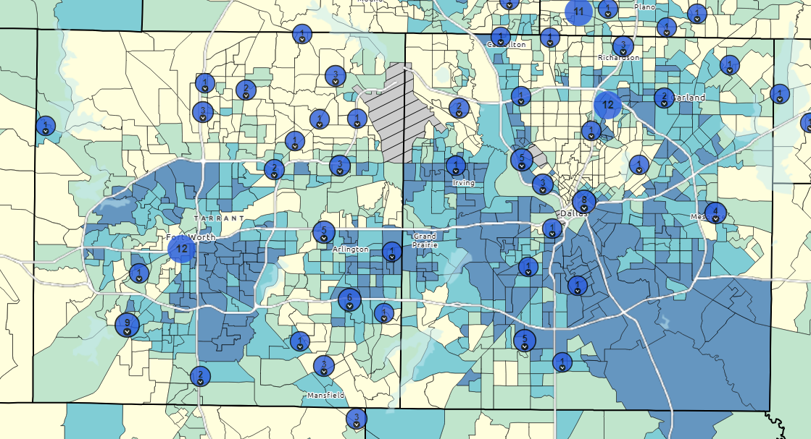

```{r global_options, echo=FALSE}
knitr::opts_chunk$set(fig.height=8, fig.width=8, fig.align = "center", warning=FALSE, echo=FALSE, tidy=TRUE, tidy.opts=list(width.cutoff=60))
```

------------------------------------------------------------------------

```{r, results='hide', warning=FALSE, message=FALSE}
library(dplyr)
library(tidyverse)
library(ggplot2)
library(lubridate)
library(patchwork)
```

# Introduction
This week, we need to target why specific pairs of cities have disparities so that we can generalize in the following weeks. In particular, why do Fort Worth and Dallas (nearby cities) have differences in their flu patients over time? We could use the Social Vulnerability Index (SVI) as a key feature in our analysis, provided we understand how it is calculated and extract the relevant information.

As far as changing statistical techniques, we'd also like to focus more on weekly time-series data, normalizing statistics per capita, and trying to visualize this data with maps. Time permitting, I'd also like to take a look at last week's hypothesis of faster "recovery time" with more hospitals (Houston, Dallas).

\newpage

# Improving statistical analysis and data cleaning

```{r, cache=TRUE}
hospitals = read.csv("../COVID-19_Reported_Patient_Impact_and_Hospital_Capacity_by_Facility.csv")
hospitals = hospitals[hospitals$state=="TX",] %>% mutate(city = str_to_title(city))
```

```{r, cache = TRUE}
flu_complete = read.csv("../DSHS/flu_data_complete.csv")

city_trend = flu_complete %>%
  filter(PAT_STATE == "TX") %>%
  group_by(quarter, PAT_City) %>%
  summarise(total_patients = n(), .groups = "drop")

# Focus on major cities
major_cities = c("Houston", "San Antonio", "Dallas", "Austin", "Fort Worth", "El Paso", "Arlington", "Corpus Christi")

city_trend_major = city_trend %>% filter(PAT_City %in% major_cities) %>% mutate(PAT_City = factor(PAT_City, levels = major_cities))
```

```{r, fig.height=4, fig.width=10}
hospitals_major = hospitals %>% filter(city %in% major_cities) %>% mutate(city = factor(city, levels = major_cities))
desired_columns = c("hospital_pk", "collection_week", "hospital_name", "city", "hospital_subtype", "total_beds_7_day_avg", "total_patients_hospitalized_confirmed_influenza_7_day_sum", "total_patients_hospitalized_confirmed_influenza_7_day_avg")

hospitals_major = hospitals_major %>%
  select(all_of(desired_columns)) %>%  
  rename(
    id = hospital_pk,
    week = collection_week,
    name = hospital_name,
    city = city,
    subtype = hospital_subtype,
    beds_avg = total_beds_7_day_avg,
    flu_sum = total_patients_hospitalized_confirmed_influenza_7_day_sum,
    flu_avg = total_patients_hospitalized_confirmed_influenza_7_day_avg) 

hospitals_major = hospitals_major %>% mutate(across(c(beds_avg, flu_sum, flu_avg), ~ifelse(. <= 0, NA, .)))
```

## Weekly time-series data
```{r, fig.height = 8, fig.width = 10, message = "false"}
weekly_city_data = hospitals_major %>% drop_na(beds_avg) %>% mutate(week = as.Date(week)) %>% group_by(city, week) %>% summarize(total_beds = sum(beds_avg), .groups = "drop")

regular = ggplot(weekly_city_data, aes(x = week, y = total_beds)) + geom_line() + geom_smooth(color = "red", se = FALSE) + facet_wrap(~ city, nrow=8) + 
  labs(title = "Hospital Beds by City over Time", x = "Year", y= "Beds")
```

```{r} 
# gotta clean up this data
city_pop = read.csv("../texas_city_pop.csv")
city_pop = city_pop[c(3:1233), c(1, 3:6)]

names(city_pop) = as.character(city_pop[1, ])
names(city_pop)[1] = "City"
city_pop = city_pop[-1, ]

city_pop = city_pop[c(52, 270, 44, 237, 340, 972, 497, 376),]
city_pop$City = c("Austin", "Dallas", "Arlington", "Corpus Christi", "El Paso", "San Antonio", "Houston", "Fort Worth")
city_pop = city_pop %>%  mutate(across(2:5, ~ as.numeric(gsub("[^0-9.-]", "", .)))) %>% arrange(desc(1))
```

```{r, fig.height = 8, fig.width = 10, message = "false", warning = "false"}
city_pop_long = city_pop %>% pivot_longer(-City, names_to = "year", values_to = "population") %>% mutate(year = as.integer(year))

weekly_city_data_norm = weekly_city_data %>% mutate(year = as.integer(format(week, "%Y"))) %>% left_join(city_pop_long, by = c("city" = "City", "year" = "year")) %>% 
  mutate(beds_per_100k = total_beds / population * 100000) %>% mutate(city = factor(city, levels = major_cities))

normalized = ggplot(weekly_city_data_norm, aes(x = week, y = beds_per_100k)) + geom_line() + geom_smooth() + facet_wrap(~ city, nrow=8) + 
  labs(title = "Hospital Beds per 100,000 by City over Time", x = "Year", y= "Beds per 100,000")
```

```{r, fig.width = 10, fig.height = 14, message = "false", warning = "false"}
regular + normalized
```

What does this graph show us? Let's unpack our findings real quick. Clearly, we can see that the trends are much more visible on the right hand side. Corpus Christi, Houston, and San Antonio have the most beds per 100,000 while Austin and El Paso have the fewest. We can also see the Ft. Worth vs Dallas comparison here (a little spoiler for the analysis that's later in the report).

## Comparing state-wide
```{r, cache=TRUE}
state = read.csv("../COVID-19_Reported_Patient_Impact_and_Hospital_Capacity_by_State.csv")
state = state[state$state == "TX",]
```

```{r}
state_important = state[,c(2,3,4,5,11,13)]
colnames(state_important) = c("day", "shortage_yes", "shortage_no", "shortage_not_reported", "beds", "beds_used")

state_important = state_important[state_important$beds > 100,]

state_important$shortage_prop = (state_important$shortage_yes) / (state_important$shortage_no + state_important$shortage_not_reported)
state_important$beds_used_prop = (state_important$beds_used) / (state_important$beds)
state_important$day = as.Date(state_important$day)

state_important = state_important[,c(1, 5, 7, 8)]
```

```{r}
texas_pop = read.csv("../texas_pop.csv")
texas_pop = texas_pop[,c(1,2)]

texas_pop$population = as.numeric(gsub("[^0-9.-]", "", texas_pop$population))

state_important = state_important %>% mutate(year = year(day)) %>% left_join(texas_pop, by = "year") %>% mutate(beds_per_100k = beds / population * 100000)
```

```{r, fig.width = 10, fig.height = 8, message = FALSE}
beds = ggplot(state_important, aes(x=day, y=beds_per_100k)) + geom_line() + geom_smooth() + labs(title = "Texas Hospital Beds per 100,000 over Time", x = "Year", y= "Beds per 100,000")
beds_used = ggplot(state_important, aes(x=day, y=beds_used_prop)) + geom_line() + geom_smooth() + labs(title = "Proportion of Used Texas Hospital Beds over Time", x = "Year", y= "Proportion of Beds Used")
shortage = ggplot(state_important, aes(x=day, y=shortage_prop)) + geom_line() + geom_smooth() + labs(title = "Proportion of Critical Shortages over Time", x = "Year", y= "Proportion of Critical Shortages")

beds / beds_used / shortage
```

## Visualizing with maps

# Social Vulnerability Index

## How it is calculated

## Why it's relevant + trends

# Fort Worth vs. Dallas

## Demographics

## Healthcare access
```{r}
hospitals_by_year = hospitals_major %>%
  mutate(year = year(week)) %>%  # Extract year from date column
  group_by(id, year, name, city) %>%
  summarise(
    beds_avg = mean(beds_avg, na.rm = TRUE),
    flu_sum = mean(flu_sum, na.rm = TRUE),
    flu_avg = mean(flu_avg, na.rm = TRUE),
    entries = n(),
    .groups = "drop"
  )

unique_hospitals_by_city = hospitals_by_year %>%
  filter(city %in% c("Dallas", "Fort Worth")) %>%
  group_by(city) %>%
  summarise(unique_hospitals = n_distinct(id), .groups = "drop") %>% 
  arrange(desc(unique_hospitals))

knitr::kable(unique_hospitals_by_city)
```

## Conclusion

# Last week's hypothesis and relevance

