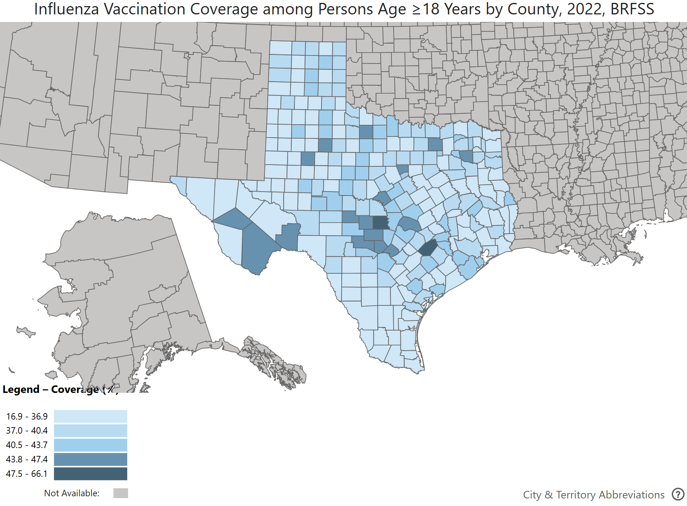

```{r global_options, echo=FALSE}
knitr::opts_chunk$set(fig.height=8, fig.width=8, fig.align = "center", warning=FALSE, echo=FALSE, tidy=TRUE, tidy.opts=list(width.cutoff=60))
```

------------------------------------------------------------------------

```{r, results='hide', warning=FALSE, message=FALSE}
library(dplyr)
library(tidyverse)
library(ggplot2)
library(lubridate)
library(patchwork)
```

# Introduction
This week, we want to understand disparities in flu patients by city with the help of normalization. From our very helpful population dataset, we'll take a look at major Texas cities and identify any trends. Perhaps, we can investigate flu season by flu season in time-series data as well as looking at qualitative explanations for the rise in flu patients. I'll also look at temperature data and try to graph that data over time and space (https://www.weather.gov/wrh/climate?wfo=ewx) and I'll also take a look at healthcare metrics like one from the City Health Dashboard and I also want to maybe find a dataset that holds Texas flu vaccinations by city.

\newpage

# Normalizing flu data by population
```{r}
facility = read.csv("../DSHS/thcic-ids_city_county_crosswalk.csv")
facility_filtered = facility %>%
  group_by(THCIC_ID) %>%
  filter(YEAR == max(YEAR)) %>%
  ungroup()

TX_zip_zcta_pop_city = read.csv("../DSHS/TX_zip_zcta_pop_city.csv")
TX_zcta_pop_city = TX_zip_zcta_pop_city %>%
  select(zcta, City, population) %>%
  distinct() %>%
  group_by(City) %>%
  summarise(population = sum(population))

County = read.csv("../DSHS/county_fips_us.csv")
```

```{r}
flu22_3 = read.csv("../DSHS/FLU_ALL_PAT_CAT_2022Q3.csv")
flu22_4 = read.csv("../DSHS/FLU_ALL_PAT_CAT_2022Q4.csv")
flu23_1 = read.csv("../DSHS/FLU_ALL_PAT_CAT_2023Q1.csv")
flu23_2 = read.csv("../DSHS/FLU_ALL_PAT_CAT_2023Q2.csv")
flu23_3 = read.csv("../DSHS/FLU_ALL_PAT_CAT_2023Q3.csv")
flu23_4 = read.csv("../DSHS/FLU_ALL_PAT_CAT_2023Q4.csv")
flu24_1 = read.csv("../DSHS/FLU_ALL_PAT_CAT_2024Q1.csv")
flu24_2 = read.csv("../DSHS/FLU_ALL_PAT_CAT_2024Q2.csv")
```

```{r}
flu_all_pat_filter = function(flu1){
  flu11 = flu1 %>%
    select(THCIC_ID, PAT_STATE, PAT_ZIP, PAT_COUNTRY, PAT_COUNTY) %>%
    mutate(PAT_ZIP = ifelse(nchar(PAT_ZIP) < 5 | grepl("\\D", PAT_ZIP), NA, PAT_ZIP)) %>%
    mutate(
      PAT_COUNTY_FIPS = str_pad(PAT_COUNTY, width = 3, side = "left", pad = "0"),
      PAT_COUNTY_FIPS = paste0("48", PAT_COUNTY_FIPS)
    ) %>%
    mutate(PAT_COUNTY_FIPS = as.integer(PAT_COUNTY_FIPS),
           PAT_ZIP = as.integer(PAT_ZIP)) %>%
    left_join(County, by = c("PAT_COUNTY_FIPS" = "FIPS")) %>%
    rename(PAT_County = County) %>%
    select(-State.Abbreviation, -State.Name, -FIPS_int, -PAT_COUNTRY) %>%
    left_join(TX_zip_zcta_pop_city, by = c("PAT_ZIP" = "ZIP_CODE", "PAT_STATE" = "STATE")) %>%
    rename(PAT_zcta = zcta, 
           PAT_City = City, 
           PAT_PO_NAME = PO_NAME,
           PAT_population = population) 
  
  flu12 = flu11 %>%
    left_join(facility_filtered, by = "THCIC_ID") %>%
    select(-HOSP_NAME, -HOSP_NAME_clean) %>%
    filter(!is.na(HOSP_CITY) & !is.na(PAT_City)) 
  return(flu12)
}
```

```{r warning = FALSE}
flu22_3_prop = flu_all_pat_filter(flu22_3)
flu22_4_prop = flu_all_pat_filter(flu22_4)
flu23_1_prop = flu_all_pat_filter(flu23_1)
flu23_2_prop = flu_all_pat_filter(flu23_2)
flu23_3_prop = flu_all_pat_filter(flu23_3)
flu23_4_prop = flu_all_pat_filter(flu23_4)
flu24_1_prop = flu_all_pat_filter(flu24_1)
flu24_2_prop = flu_all_pat_filter(flu24_2)

# Add quarter tag and combine
flu22_3_prop$year = 2022
flu22_3_prop$quarter = "2022Q3"

flu22_4_prop$year = 2022
flu22_4_prop$quarter = "2022Q4"

flu23_1_prop$year = 2023
flu23_1_prop$quarter = "2023Q1"

flu23_2_prop$year = 2023
flu23_2_prop$quarter = "2023Q2"

flu23_3_prop$year = 2023
flu23_3_prop$quarter = "2023Q3"

flu23_4_prop$year = 2023
flu23_4_prop$quarter = "2023Q4"

flu24_1_prop$year = 2024
flu24_1_prop$quarter = "2024Q1"

flu24_2_prop$year = 2024
flu24_2_prop$quarter = "2024Q2"

flu24_1_prop$year = 2024
flu24_2_prop$quarter = "2024Q2"

flu_all_labeled = bind_rows(
  flu22_3_prop, flu22_4_prop,
  flu23_1_prop, flu23_2_prop,
  flu23_3_prop, flu23_4_prop,
  flu24_1_prop, flu24_2_prop
)
```

```{r}
city_trend = flu_all_labeled %>%
  filter(PAT_STATE == "TX") %>%
  group_by(PAT_City, year, quarter) %>%
  summarise(total_patients = n(), .groups = "drop")

# Focus on major cities
major_cities = c("Houston", "San Antonio", "Dallas", "Austin", "Fort Worth", "El Paso", "Arlington", "Corpus Christi")
```

```{r}
pop_data_24 <- data.frame(
  year = 2024,
  City = c("Houston", "San Antonio", "Dallas", "Fort Worth", "Austin", 
           "El Paso", "Arlington", "Corpus Christi"),
  population = c(2319119, 1513974, 1302753, 996756, 984567, 678859, 399825, 316105)
)

# gotta clean up this data
city_pop = read.csv("../texas_city_pop.csv")
city_pop = city_pop[c(3:1233), c(1, 3:6)]

names(city_pop) = as.character(city_pop[1, ])
names(city_pop)[1] = "City"
city_pop = city_pop[-1, ]

city_pop = city_pop[c(52, 270, 44, 237, 340, 972, 497, 376),]
city_pop$City = c("Austin", "Dallas", "Arlington", "Corpus Christi", "El Paso", "San Antonio", "Houston", "Fort Worth")
city_pop = city_pop %>%  mutate(across(2:5, ~ as.numeric(gsub("[^0-9.-]", "", .)))) %>% arrange(desc(1))
city_pop_long = city_pop %>% pivot_longer(-City, names_to = "year", values_to = "population") %>% mutate(year = as.integer(year))
city_pop_long = rbind(city_pop_long, pop_data_24)
```

```{r}
city_trend_major = city_trend %>% filter(PAT_City %in% major_cities) %>% mutate(PAT_City = factor(PAT_City, levels = major_cities))

city_trend_major = city_trend_major %>% left_join(city_pop_long, by = c("PAT_City" = "City", "year" = "year")) %>% 
  mutate(patients_per_100k = total_patients / population * 100000)
```

## Analyzing the extreme cities
```{r, fig.height=6, fig.width=12}
ggplot(city_trend_major, aes(x = quarter, y = patients_per_100k, group = PAT_City, color = PAT_City)) +
  geom_line(linewidth = 1,) +
  geom_point() +
  labs(title = "Flu patients per 100,000 over time by city", x = "Quarter", y = "Patients per 100,000", color = "City") +
  theme(axis.text.x = element_text(angle = 45, hjust = 1)) 
```
I mainly created this graph so that I could look at these two flu seasons and examine the highest and lowest flu patients per 100,000. For the first flu cycle, we can see that Fort Worth and Corpus Christi had the highest patients per 100,000 while Austin clearly had the lowest each season, followed by Arlington in the first and Houston in the second cycle. I'm not sure why Austin has these low values but Corpus Christi might be a hot tourist spot during the holidays, which would raise flu cases without raising population, so that could be a contributing factor.


## Comparing regular counts and normalized counts
```{r, fig.height=12, fig.width=10}
regular = ggplot(city_trend_major, aes(x = quarter, y = total_patients, group = PAT_City)) +
  geom_line(linewidth = 1.2, color = "blue") +
  geom_point(color = "blue") +
  labs(title = "Patients over time by city", x = "Quarter", y = "Flu patients", color = "City") +
  theme(axis.text.x = element_text(angle = 45, hjust = 1)) + facet_wrap(~PAT_City, nrow = 8)

normalized = ggplot(city_trend_major, aes(x = quarter, y = patients_per_100k, group = PAT_City)) +
  geom_line(linewidth = 1.2, color = "red") +
  geom_point(color = "red") +
  labs(title = "Patients per 100,000 over time by city", x = "Quarter", y = "Flu patients per 100,000", color = "City") +
  theme(axis.text.x = element_text(angle = 45, hjust = 1)) + facet_wrap(~PAT_City, nrow = 8)

regular + normalized
```
As for the normalized metrics, this is pretty similar to the last graph but we see that places like Corpus Christi, El Paso, and Fort Worth are much more accurately represented by the normalized values. Looks like most major Texas cities share this same pattern and similar spike heights as well.

# City Health Dashboard
The City Health Dashboard compiles a various set of metrics yearly (the most recent being 2022) and I have selected three of those metrics that seemed the most relevant: **Percentage of Children in Poverty**, **Uninsured Percentage**, and **Routine Checkup Percentage**
```{r}
city_health = read.csv("../texas_cityhealth.csv")
```

## Percentage of Children in Poverty  
```{r}
knitr::kable(city_health %>% filter(Metric == "Children in Poverty (%)") %>% select(City, Value) %>% arrange(Value), caption = "Cities by % of Children in Poverty in 2022", col.names = c("City", "Children in Poverty (%)"))
```
I don't think this has a large amount of correlation with flu patient counts, but Austin does seem to have the lowest percentage of children in poverty,


## Uninsured Percentage
```{r}
knitr::kable(city_health %>% filter(Metric == "Uninsured (%)") %>% select(City, Value) %>% arrange(Value), caption = "Cities by % Uninsured in 2022", col.names = c("City", "Uninsured (%)"))
```
I think this metric might have a greater effect because insurance does decrease the cost of a flu vaccine. I think Austin being at the top of the list again is very telling because even though this is only 2022 data.

## Routine Checkup Percentage
```{r}
knitr::kable(city_health %>% filter(Metric == "Routine Checkup (%)") %>% select(City, Value) %>% arrange(desc(Value)), caption = "Cities by % that get Routine Checkups in 2022", col.names = c("City", "Routine Checkup (%)"))
```
Lastly, this seems like a metric that might decrease total flu patients when the flu is in full force, but not so much for vaccination. Regardless, Austin hits the bottom of this list while San Antonio takes a surprising spot at the top of the table.

# Temperature
## Temperature by county
```{r}
counties = c("Harris County", "Bexar County", "Dallas County", "Travis County", "Tarrant County", "El Paso County", "Tarrant County", "Nueces County")

corresponding_cities = c(
  "San Antonio",       # Bexar County
  "Dallas",            # Dallas County
  "El Paso",           # El Paso County
  "Houston",           # Harris County
  "Corpus Christi",    # Nueces County
  "Fort Worth & Arlington", # Tarrant County
  "Austin"             # Travis County
)
```

```{r}
twenty = read.csv("../Temperature/2020.csv")
twenty$Year = 2020

twenty_one = read.csv("../Temperature/2021.csv")
twenty_one$Year = 2021

twenty_two = read.csv("../Temperature/2022.csv")
twenty_two$Year = 2022

twenty_three = read.csv("../Temperature/2023.csv")
twenty_three$Year = 2023

twenty_four = read.csv("../Temperature/2024.csv")
twenty_four$Year = 2024

weather = rbind(
  twenty,
  twenty_one,
  twenty_two,
  twenty_three,
  twenty_four
)

weather = weather %>% select(Name, Value, Year) %>% filter(Name %in% counties) %>% arrange(desc(Name))
colnames(weather) = c("county", "avg_temp", "year")

write_csv(weather, "../texas_weather.csv")
```

```{r, fig.width = 8, fig.height = 5}
ggplot(weather, aes(x=year, y=avg_temp, color = county)) + geom_line(linewidth = 1) + labs(title = "Average Temperature by Year by County", x = "Year", y = "Average Temperature (year)") + geom_point()
```


## How flu and temperature are related
Generally, the influenza virus thrives in cooler, drier environments while warmer, humid environments weaken the virus. Nueces County is the highest in terms of heat and Corpus Christi does not follow the general trend. The average temperature over the year probably doesn't make that much of an effect but it might explain northern cities having more flu patients than southern cities like Tarrant County (Arlington/Ft. Worth) vs Bexar County (San Antonio).

# Flu vaccination coverage

The above image is a flu vaccination coverage map of Texas, shaded by the county's flu vaccination coverage (darker is better).

## Coverage data
```{r}
corresponding_cities_vax = c(
  "Houston",           # Harris County
  "San Antonio",       # Bexar County
  "Dallas",            # Dallas County
  "Austin",            # Travis County
  "Fort Worth & Arlington", # Tarrant County
  "El Paso",           # El Paso County
  "Corpus Christi"     # Nueces County
)

texas_flu_vax = data.frame(
  county = unique(counties),
  corresponding_cities = corresponding_cities_vax,
  coverage_rate = c(38.4, 41.4, 39.9, 42.5, 39.4, 38, 34.1)
) %>% arrange(desc(coverage_rate))

knitr::kable(texas_flu_vax, caption = "Flu Vaccination Coverage Estimates by County in 2022", col.names = c("County", "Corresponding Cities", "Coverage Rate"))
```
## Analysis
Aha! Looks like this is our magic weapon! Corpus Christi sits at the bottom of the table with cities like El Paso and Houston while Austin rests comfortably at the top with cities like San Antonio. If you reference the first figure in this week's report, you'll find this is the most accurate predictor we've examined so far.

# Conclusion
We found the normalized versions of flu patients, compared them across cities, and then attempted to find predictors for the trends we saw. We looked at 3 City Health Dashboard metrics, temperature, and flu vaccination coverage. I think they all had some weak/mid correlation but flu vaccination coverage had the clearest trends by far (which makes sense). Next week, we might look at more predictors or dig further into health insurance prevalence and flu vaccination coverage.

