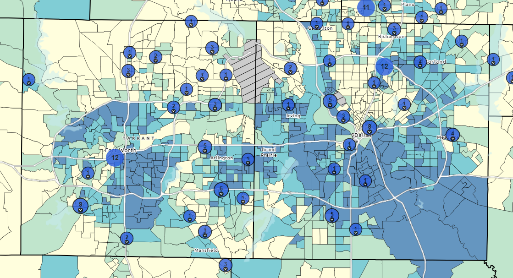

```{r global_options, echo=FALSE}
knitr::opts_chunk$set(fig.height=8, fig.width=8, fig.align = "center", warning=FALSE, echo=FALSE, tidy=TRUE, tidy.opts=list(width.cutoff=60))
```

------------------------------------------------------------------------

```{r, results='hide', warning=FALSE, message=FALSE}
library(dplyr)
library(tidyverse)
library(ggplot2)
library(lubridate)
library(patchwork)
```

# Introduction
This week, we need to target why specific pairs of cities have disparities so that we can generalize in the following weeks. In particular, why do Fort Worth and Dallas (nearby cities) have differences in their flu patients over time? We could use the Social Vulnerability Index (SVI) as a key feature in our analysis, provided we understand how it is calculated and extract the relevant information.

As far as changing statistical techniques, we'd also like to focus more on weekly time-series data, normalizing statistics per capita, and trying to visualize this data with maps. Time permitting, I'd also like to take a look at last week's hypothesis of faster "recovery time" with more hospitals (Houston, Dallas).

\newpage

# Improving statistical analysis and data cleaning

```{r, cache=TRUE}
hospitals = read.csv("../COVID-19_Reported_Patient_Impact_and_Hospital_Capacity_by_Facility.csv")
hospitals = hospitals[hospitals$state=="TX",] %>% mutate(city = str_to_title(city))
```

```{r, cache = TRUE}
flu_complete = read.csv("../DSHS/flu_data_complete.csv")

city_trend = flu_complete %>%
  filter(PAT_STATE == "TX") %>%
  group_by(quarter, PAT_City) %>%
  summarise(total_patients = n(), .groups = "drop")

# Focus on major cities
major_cities = c("Houston", "San Antonio", "Dallas", "Austin", "Fort Worth", "El Paso", "Arlington", "Corpus Christi")

city_trend_major = city_trend %>% filter(PAT_City %in% major_cities) %>% mutate(PAT_City = factor(PAT_City, levels = major_cities))
```

```{r, fig.height=4, fig.width=10}
hospitals_major = hospitals %>% filter(city %in% major_cities) %>% mutate(city = factor(city, levels = major_cities))
desired_columns = c("hospital_pk", "collection_week", "hospital_name", "city", "hospital_subtype", "total_beds_7_day_avg", "total_patients_hospitalized_confirmed_influenza_7_day_sum", "total_patients_hospitalized_confirmed_influenza_7_day_avg")

hospitals_major = hospitals_major %>%
  select(all_of(desired_columns)) %>%  
  rename(
    id = hospital_pk,
    week = collection_week,
    name = hospital_name,
    city = city,
    subtype = hospital_subtype,
    beds_avg = total_beds_7_day_avg,
    flu_sum = total_patients_hospitalized_confirmed_influenza_7_day_sum,
    flu_avg = total_patients_hospitalized_confirmed_influenza_7_day_avg) 

hospitals_major = hospitals_major %>% mutate(across(c(beds_avg, flu_sum, flu_avg), ~ifelse(. <= 0, NA, .)))
```

## Weekly time-series data
```{r, fig.height = 8, fig.width = 10, message = "false"}
weekly_city_data = hospitals_major %>% drop_na(beds_avg) %>% mutate(week = as.Date(week)) %>% group_by(city, week) %>% summarize(total_beds = sum(beds_avg), .groups = "drop")

regular = ggplot(weekly_city_data, aes(x = week, y = total_beds)) + geom_line() + geom_smooth(color = "red", se = FALSE) + facet_wrap(~ city, nrow=8) + 
  labs(title = "Hospital Beds by City over Time", x = "Year", y= "Beds")
```

```{r} 
# gotta clean up this data
city_pop = read.csv("../texas_city_pop.csv")
city_pop = city_pop[c(3:1233), c(1, 3:6)]

names(city_pop) = as.character(city_pop[1, ])
names(city_pop)[1] = "City"
city_pop = city_pop[-1, ]

city_pop = city_pop[c(52, 270, 44, 237, 340, 972, 497, 376),]
city_pop$City = c("Austin", "Dallas", "Arlington", "Corpus Christi", "El Paso", "San Antonio", "Houston", "Fort Worth")
city_pop = city_pop %>%  mutate(across(2:5, ~ as.numeric(gsub("[^0-9.-]", "", .)))) %>% arrange(desc(1))
```

```{r, fig.height = 8, fig.width = 10, message = "false", warning = "false"}
city_pop_long = city_pop %>% pivot_longer(-City, names_to = "year", values_to = "population") %>% mutate(year = as.integer(year))

weekly_city_data_norm = weekly_city_data %>% mutate(year = as.integer(format(week, "%Y"))) %>% left_join(city_pop_long, by = c("city" = "City", "year" = "year")) %>% 
  mutate(beds_per_100k = total_beds / population * 100000) %>% mutate(city = factor(city, levels = major_cities))

normalized = ggplot(weekly_city_data_norm, aes(x = week, y = beds_per_100k)) + geom_line() + geom_smooth() + facet_wrap(~ city, nrow=8) + 
  labs(title = "Hospital Beds per 100,000 by City over Time", x = "Year", y= "Beds per 100,000")
```

```{r, fig.width = 10, fig.height = 14, message = "false", warning = "false"}
regular + normalized
```

What does this graph show us? Let's unpack our findings real quick. Clearly, we can see that the trends are much more visible on the right hand side. Corpus Christi, Houston, and San Antonio have the most beds per 100,000 while Austin and El Paso have the fewest. We can also see the Ft. Worth vs Dallas comparison here (a little spoiler for the analysis that's later in the report).

## Comparing state-wide
```{r, cache=TRUE}
state = read.csv("../COVID-19_Reported_Patient_Impact_and_Hospital_Capacity_by_State.csv")
state = state[state$state == "TX",]
```

```{r}
state_important = state[,c(2,3,4,5,11,13)]
colnames(state_important) = c("day", "shortage_yes", "shortage_no", "shortage_not_reported", "beds", "beds_used")

state_important = state_important[state_important$beds > 100,]

state_important$shortage_prop = (state_important$shortage_yes) / (state_important$shortage_no + state_important$shortage_not_reported)
state_important$beds_used_prop = (state_important$beds_used) / (state_important$beds)
state_important$day = as.Date(state_important$day)

state_important = state_important[,c(1, 5, 7, 8)]
```

```{r}
texas_pop = read.csv("../texas_pop.csv")
texas_pop = texas_pop[,c(1,2)]

texas_pop$population = as.numeric(gsub("[^0-9.-]", "", texas_pop$population))

state_important = state_important %>% mutate(year = year(day)) %>% left_join(texas_pop, by = "year") %>% mutate(beds_per_100k = beds / population * 100000)
```

```{r, fig.width = 10, fig.height = 8, message = FALSE}
beds = ggplot(state_important, aes(x=day, y=beds_per_100k)) + geom_line() + geom_smooth() + labs(title = "Texas Hospital Beds per 100,000 over Time", x = "Year", y= "Beds per 100,000")
beds_used = ggplot(state_important, aes(x=day, y=beds_used_prop)) + geom_line() + geom_smooth() + labs(title = "Proportion of Used Texas Hospital Beds over Time", x = "Year", y= "Proportion of Beds Used")
shortage = ggplot(state_important, aes(x=day, y=shortage_prop)) + geom_line() + geom_smooth() + labs(title = "Proportion of Critical Shortages over Time", x = "Year", y= "Proportion of Critical Shortages")

beds / beds_used / shortage
```
A quick aside for the data wrangling steps: I removed about 10 entries that had a bed count under 100, which seemed completely unreasonable for an entire state.

First off, we can ignore the critical shortages graph because it is mainly just representing the onset of COVID-19 and accompanying pandemic. Next, the proportion of used hospital beds looks to stay stagnant over time, and it is likely that the early low values are due to a lack of reporting in that area until about mid-2020.

The most useful graph in this set is the last one, which displays the beds per 100,000. We can say that after the stabilization, Texas' beds per 100,000 hovers roughly around 200 per 100,000, a figure that is supported by the below table.

```{r}
summary_df = data.frame(
  Statistic = names(summary(state_important$beds_per_100k)),
  Value = round(as.vector(summary(state_important$beds_per_100k)),2)
)

knitr::kable(summary_df, caption = "Distribution statistics for Texas hospital beds per 100,000")
```

Now, let's take this average state-wide data and compare it to each individual city.

```{r, warning = "FALSE", message = "FALSE", fig.width = 10, fig.height = 5}
ggplot(weekly_city_data_norm, aes(x = week, y = beds_per_100k)) + geom_line() + geom_smooth() + facet_wrap(~ city, nrow = 2) + 
  labs(title = "Hospital Beds per 100,000 by City over Time", x = "Year", y= "Beds per 100,000") + geom_hline(yintercept = 193.5, color = "red")
```
Right away, we can say that Corpus Christi has a lot more beds per 100,000 relative to its population size, while cities like Austin and Arlington barely pass the statewide mark. Therefore, we could investigate further and might find a trend that Austin and Arlington take longer to "recover" due to possible shortages or limited equipment (another foreshadowing).


# Social Vulnerability Index

The above graphic is a screenshot displaying the SVI map for the state of Texas.

## How it is calculated
*The following information comes directly from the attached PDF that comes with the SVI data.*

Every community must prepare for and respond to hazardous events, whether a natural disaster like a tornado or a disease outbreak, or an anthropogenic event such as a harmful chemical spill. The degree to which a community exhibits certain social conditions, including high poverty, low percentage of vehicle access, or crowded households, among others, may affect that community’s ability to prevent human suffering and financial loss in the event of a disaster. These factors describe a community’s social vulnerability. 

SVI indicates the relative vulnerability of every U.S. census tract. Census tracts are subdivisions of counties for which the Census collects statistical data. SVI ranks the tracts on 16 social factors, such as unemployment, racial and ethnic minority status, and disability status. Then, SVI further groups the factors into four related themes. Thus, each tract receives a ranking for each Census variable and for each of the four themes as well as an overall ranking. 

We will be using the overall ranking in our calculations since there is no healthcare metric - below is a list of the 16 factors.

- **Socioeconomic Status**
  - Below 150% Poverty
  - Unemployed
  - Housing Cost Burden
  - No High School Diploma
  - No Health Insurance

- **Household Characteristics**
  - Aged 65 & Older
  - Aged 17 & Younger
  - Civilian with a Disability
  - Single-Parent Households
  - English Language Proficiency

- **Racial & Ethnic Minority Status***
  - Hispanic or Latino (of any race)
  - Black and African American, Not Hispanic or Latino
  - American Indian and Alaska Native, Not Hispanic or Latino
  - Asian, Not Hispanic or Latino
  - Native Hawaiian and Other Pacific Islander, Not Hispanic or Latino
  - Two or More Races, Not Hispanic or Latino
  - Other Races, Not Hispanic or Latino

- **Housing Type & Transportation**
  - Multi-Unit Structures
  - Mobile Homes
  - Crowding
  - No Vehicle
  - Group Quarters

## Why it's relevant + trends
A higher social vulnerability corresponds to a higher SVI percentile and the below table represents the major cities and their SVI values, sorted by the least socially vulnerable county.
```{r}
texas_svi = read.csv("../texas_svi.csv")
counties = c("Harris County", "Bexar County", "Dallas County", "Travis County", "Tarrant County", "El Paso County", "Tarrant County", "Nueces County")

corresponding_cities = c(
  "San Antonio",       # Bexar County
  "Dallas",            # Dallas County
  "El Paso",           # El Paso County
  "Houston",           # Harris County
  "Corpus Christi",    # Nueces County
  "Fort Worth & Arlington", # Tarrant County
  "Austin"             # Travis County
)

texas_svi_major = texas_svi %>% filter(COUNTY %in% counties) %>% select(COUNTY, RPL_THEMES) %>% add_column(City = corresponding_cities, .before = 2) %>% arrange((RPL_THEMES))
knitr::kable(texas_svi_major, caption = "Texas County SVI Percentile with corresponding Major Texas Cities", col.names = c("County", "Corresponding Cities", "SVI Percentile (0-1)"))
```

What's interesting is that even though Austin and Arlington barely had more beds than the state-wide mark, their counties seem to have less social vulnerability. However, there are lots of confounders because of the other factors in SVI and an improvement would be to only select healthcare factors (none of the SVI themes directly match up so I decided to use the entire metric). Disregarding hospital beds per 100,000, this trend makes sense because El Paso is a border city and likely has conflict while Dallas and Houston bring social vulnerability by virtue of having massive populations.

# Fort Worth vs. Dallas
## SVI Comparison

If we examine this map above, we can see that Fort Worth and Dallas have slightly different distributions of the SVI index (the darker, the more vulnerable just like before). It is important to understand that these areas are census tracts, which are created outside of political boundaries and meant to average a certain population per tract, which leads to major variation in the land size. However, upon a closer look, those more vulnerable areas simply have more land area and falsely portray greater vulnerability in Dallas. Therefore, I think we can conclude that Fort Worth and Dallas likely have similar SVI distributions.

## Demographics
```{r}
knitr::kable(city_pop[city_pop$City == "Dallas" | city_pop$City == "Fort Worth",], row.names = FALSE, caption = "Population of Dallas and Fort Worth (2020-2023)")
```
Dallas has a larger population than Fort Worth yet more beds per 100,000 by 100 beds. 

## Healthcare access
```{r}
hospitals_by_year = hospitals_major %>%
  mutate(year = year(week)) %>%  # Extract year from date column
  group_by(id, year, name, city) %>%
  summarise(
    beds_avg = mean(beds_avg, na.rm = TRUE),
    flu_sum = mean(flu_sum, na.rm = TRUE),
    flu_avg = mean(flu_avg, na.rm = TRUE),
    entries = n(),
    .groups = "drop"
  )

unique_hospitals_by_city = hospitals_by_year %>%
  filter(city %in% c("Dallas", "Fort Worth")) %>%
  group_by(city) %>%
  summarise(unique_hospitals = n_distinct(id), .groups = "drop") %>% 
  arrange(desc(unique_hospitals))

knitr::kable(unique_hospitals_by_city, caption = "Hospitals of Dallas and Fort Worth", col.names = c("City", "Hospitals"))
```
Makes sense, the reason Dallas has more beds/100k is because they simply have more hospitals. This may be due to Dallas being more dense and creating more hospitals per population because it is a major city built to handle crises. Anyway, the hospitals explain the beds.

## Conclusion
While the flu patients were almost identical, the beds looked different when normalized but this simply boils down to more hospitals in the city of Dallas as compared to the city of Fort Worth.

# Last week's hypothesis and relevance
While it is wishy-washy in a sense, I think another research rabbit hole to dive down is the recovery rate of cities after pandemics or seasonal flu outbreaks and how that is affected by hospitals, population density, the SVI metric, and other factors. We saw conflicting values today, particularly Austin/Arlington, which motivate me to shelve this idea for now.

# Conclusion
This week, I investigated state-wide and city-wide time-series data and tried to discern trends with the help of external population and SVI data. I did find some interesting insights into SVI and normalizing the population revealed interesting outliers like Corpus Christi (which may due to its presence as a vacation spot) and underachievers like Austin/Arlington. Good progress this week, I think I can write more about actual results next week or very soon.

